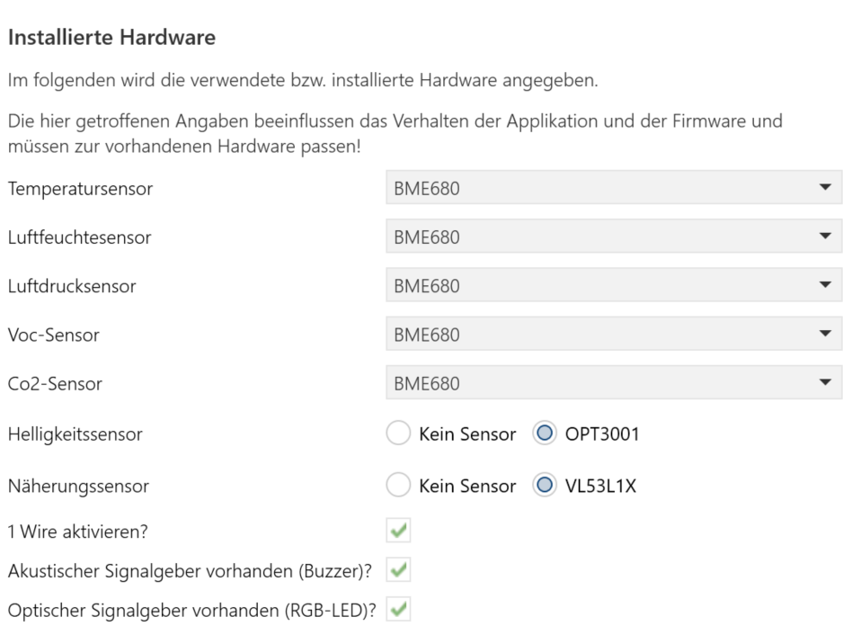
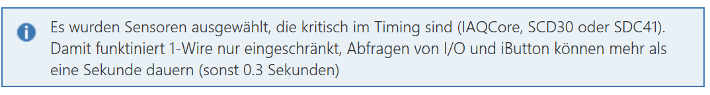
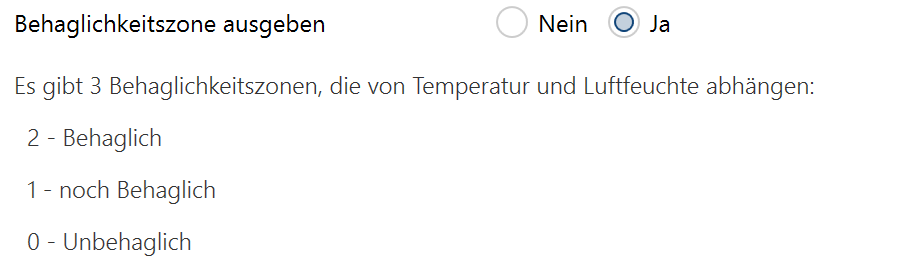

<!-- 
cSpell:words knxprod Masifi SAMD21 einheitenlos Luftfeuchtesensor engl Pieptönen
cSpell:words Glättungsfunktion Glättungsformel Behaglichkeitszone Behaglichkeitszonen Kalibrierungswerte Kalibrierungsfortschritt Kalibrierungsdaten KalibrierungLoeschen Bitleiste Behaglichkeitswert Kalibrierungsgrad
 -->

# **Applikationsbeschreibung Sensor**

Die Applikation für das SensorModule erlaubt die Parametrisierung des Sensormoduls mittels der ETS.

Sie ist in die Bereiche

* Änderungshistorie
* Einführung
* Allgemeine Parameter
* Standardsensoren
* 1-Wire
* Logikdokumentation
* Logikkanäle

gegliedert.

Der Punkt 1-Wire ist in der Applikationsbeschreibung [OneWireGateway](https://github.com/OpenKNX/OAM-OneWireModule/blob/main/doc/Applikationsbeschreibung-Wire.md) beschrieben.
Die letzten beiden Punkte sind in der Applikationsbeschreibung [LogikModule](https://github.com/OpenKNX/OAM-LogicModule/blob/main/doc/Applikationsbeschreibung-Logik.md) beschrieben.

## **Änderungshistorie**

Im folgenden werden Änderungen an dem Dokument erfasst, damit man nicht immer das Gesamtdokument lesen muss, um Neuerungen zu erfahren.

03.05.2022: Firmware 0.8.0, Applikation 0.8 (Beta-Release)

* initiales Release als OpenKNX SensorModule
* Basiert auf dem [Vorgänger-Sensormodul](https://github.com/mumpf/knx-sensor) version 3.8 (im folgenden stehen die Neuerungen gegenüber 3.8)
* Erzeugung von Firmware und knxprod wurde stark vereinfacht
* (intern) verbesserte Kommunikation mit dem KNX-Bus
* ETS-Applikation wird auch mit der ETS 6 getestet
* Eingänge können jetzt auch beliebige Kommunikationsobjekte der gesamten Applikation (nicht nur des Logikmoduls) sein, keine Verbindung über GA nötig
* Die ETS-Applikation wurde optisch überarbeitet und übersichtlicher gestaltet
* ETS-Kanäle werden neu unterstützt
* Es wird technisch überprüft, ob die ETS-Applikation mit der installierten Firmware übereinstimmt
* **Wichtig:** Diese Version ist eine komplett neue Applikation und somit nicht kompatibel zu der früheren Version 3.8. Die ETS-Applikation muss komplett neu parametrisiert werden.

## **Einführung**

Die vorliegende Software ermöglicht es, ein Do-It-Yourself (DIY) KNX-Sensormodul zu erstellen, das mit der ETS 5.7/ETS 6 programmiert werden kann. Sie besteht, wie bei KNX üblich, aus 2 Teilen:

* der Firmware, die in die Hardware geladen wird
* der ETS-Applikation (knxprod-Datei), die in die ETS geladen wird.

Ferner wird das gesamte Setup zur Entwicklung, Änderung und Erstellung der Software mitgeliefert.

### **Hardware**

Die bevorzugte Hardware (auf der auch die Entwicklung getestet wird), ist das Sensormodul von Masifi, beschrieben als [Raum Sensormodul](https://knx-user-forum.de/forum/%C3%B6ffentlicher-bereich/knx-eib-forum/diy-do-it-yourself/1479195-raum-sensormodul-hw-thread-f%C3%BCr-temp-hum-pres-voc-co2-1-wire-buzzer) im KNX-User-Forum.

Die Software kann recht einfach auf andere Hardware portiert werden, die auf einem SAMD21 basiert, die Kommunikation mit KNX kann über einen NCN5120/5130 erfolgen oder auch über eine Siemens BCU. Sensoren werden über I2C angeschlossen.

### **Funktionsumfang**

Die Applikation und die Firmware stellen sehr viele Funktionen in verschiedenen Bereichen zur Verfügung. Dabei ist zu betonen, dass diese verschiedenen Funktionalitäten nicht unbedingt in beliebiger Kombination auch funktionieren können. Gerade von der Hardware abhängige Funktionen sind nicht in beliebiger Kombinatorik gedacht und auch nicht immer möglich.

Das soll nicht von der Nutzung abhalten, es soll nur klar machen, dass die Intention der Software eine dezentrale ist: Es soll an verschiedensten Stellen im Haus die Möglichkeit gegeben werden, ein paar Kleinigkeiten zu machen (z.B. Temperatur+Luftfeuchte messen, Fensterkontakt abfragen, Sperren durch einen Piep zu bestätigen).

Falls versucht wird, mit dem Sensormodul alle Funktionen gleichzeitig zu nutzen, also:

* 6 Inputs (Fensterkontakte, Schalter)
* 5 iButtons
* 15 1-Wire-Temperatursensoren
* 5 1-Wire Temp-/Hum-Sensoren
* LED-Ausgabe
* Buzzer
* Temperaturmessung
* Luftfeuchtemessung
* Luftdruckmessung
* VOC-Messung
* CO2-Messung
* Helligkeitsmessung
* Entfernungsmessung

das alles z.B. pro Stockwerk anzuschließen und dann auch noch über 80 Logikkanäle das restliche Haus zu steuern, dann wird das potentiell nicht laufen. Eventuell macht es dann mehr Sinn, die Funktionen auf 2, 3 oder 4 Sensormodule aufzuteilen und die in die einzelnen Räume zu platzieren und in den Räumen nur die Funktionalitäten in Betrieb zu nehmen, die dort sinnvoll sind.

Es ist wichtig zu verinnerlichen, dass die vielen Funktionen nicht dafür da sind, alle in einem Gerät genutzt zu werden, sondern dass man in vielen Geräten eher einige Wenige Funktionen nutzen kann.

Hardwareunabhängige Funktionen, in diesem Fall das Logikmodul, sind allerdings so konzipiert, dass sie immer in beliebiger Kombination und in vollem Umfang mit den anderen Features funktionieren und können bzw. sollen auch so genutzt werden.

## **Allgemeine Parameter**

<kbd></kbd>
Hier werden Einstellungen getroffen, die die generelle Arbeitsweise des Sensormoduls bestimmen.

### **Zeit bis das Gerät nach einem Neustart aktiv wird**

Nach einem Neustart des Geräts, sei es durch Busspannungsausfall, Reset über den Bus oder auch durch ein Drücken der Reset-Taste, kann man hier festlegen, wie viele Sekunden vergehen sollen, bis das Gerät seine Funktion aufnimmt.

Da das Gerät prinzipiell (sofern parametriert) auch Lesetelegramme auf den Bus senden kann, kann mit dieser Einstellung verhindert werden, dass bei einem Busneustart von vielen Geräten viele Lesetelegramme auf einmal gesendet werden und so der Bus überlastet wird.

### **In Betrieb senden alle**

Das Gerät kann einen Status "Ich bin noch in Betrieb" über das KO 1 senden. Hier wird das Sendeintervall eingestellt.

Das KO1 - In Betrieb - erscheint nur, wenn die Zeit größer 0 ist.

### **Uhrzeit und Datum nach einem Neustart vom Bus lesen**

Dieses Gerät kann Uhrzeit und Datum vom Bus empfangen. Nach einem Neustart können Uhrzeit und Datum auch aktiv über Lesetelegramme abgefragt werden. Mit diesem Parameter wird bestimmt, ob Uhrzeit und Datum nach einem Neustart aktiv gelesen werden.

Wenn dieser Parameter auf "Ja" gesetzt ist, wird die Uhrzeit und das Datum alle 20-30 Sekunden über ein Lesetelegramm vom Bus gelesen, bis eine entsprechende Antwort kommt. Falls keine Uhr im KNX-System vorhanden ist oder die Uhr nicht auf Leseanfragen antworten kann, sollte dieser Parameter auf "Nein" gesetzt werden.

Die im Logikmodul enthaltenen Zeitschaltuhren beginnen erst zu funktionieren, wenn eine gültige Uhrzeit und ein gültiges Datum empfangen wurde. Wenn dieser Parameter auf "Nein" gesetzt wird, kann es sehr lange dauern, bis Zeitschaltuhren nach einem Neustart ihre Funktion aufnehmen.

## **Installierte Hardware**

Die Firmware im Sensormodul unterstützt eine Vielzahl an Hardwarevarianten. Um nicht für jede Hardwarekombination ein eigenes Applikationsprogramm zu benötigen, kann über die folgenden Felder die Hardwareausstattung des Sensormoduls dem Applikationsprogramm mitgeteilt werden.

**Die Angaben in diesem Teil müssen der vorhandenen Hardware entsprechen**, da sie das Verhalten der Applikation und auch der Firmware bestimmen. **Das Applikationsprogramm hat keine Möglichkeit, die Korrektheit der Angaben zu überprüfen.**

Falsche Angaben können zu falschen Konfigurationen der Applikation und somit zum **Fehlverhalten des Sensormoduls** führen.

Das Sensormodul kann 7 verschiedene Standardmesswerte liefern, die von verschiedenen Hardware-Sensoren ermittelt werden können:

* Temperatur (in °C)
* Luftfeuchte (in %)
* Luftdruck (in mBar)
* VOC (einheitenlos)
* CO2 (in ppm)
* Helligkeit (in Lux)
* Entfernung (in mm)

Es werden bestimmte Hardware-Sensoren unterstützt, deren Messwerte gelesen und entsprechend auf den Bus geschickt werden können.

Die unterstützten Sensoren liefern folgende Messwerte:

Sensorauswahl | Temperatur | Luftfeuchte | Luftdruck | VOC | CO2 | Helligkeit | Entfernung
---|:---:|:---:|:---:|:---:|:---:|:---:|:---:
SHT3x   | X | X |   |   |   |
BME280  | X | X | X |   |   |
BME680  | X | X | X | X | X2)
SCD30   | X | X |   |   | X |
SCD41   | X | X |   |   | X |
SGP301)   | X | X | | X | X2)
IAQCore | | | | X | X2)
OPT300x | | | | | |  X
VL53L1X | | | | | |  | X

1)Noch in Entwicklung, die ETS Applikation unterstützt bereits die Einstellungen, die Firmware kann diese Sensoren noch nicht auswerten.

2)Bei diesem Sensor wird der CO2-Wert nicht gemessen, sondern aus dem VOC-Wert berechnet. Die Berechnung findet nicht im Sensormodul, sondern im Sensor selbst statt.

In den folgenden Auswahlfeldern kann man für jeden Standardmesswert bestimmen, von welchem Sensor dieser Messwert geliefert werden soll. Dabei können verschiedene Sensoren kombiniert werden. Bestimmte Kombinationen beeinflussen die Funktionsweise weiterer am Sensormodul angeschlossener Hardware. Solche Kombinationen führen zu Warnmeldungen.

Die Kombination vom BME280 und BME680 ist nicht möglich, da diese Sensoren die gleiche physikalische Adresse haben und somit nicht beide gleichzeitig angeschlossen werden können. Es ist aber keine Einschränkung, da der BME680 auch alle Messwerte liefern kann, die der BME280 liefert.

Sollten beide Sensoren BME280 und BME680 ausgewählt worden sein, erscheint folgende Fehlermeldung:
<kbd></kbd>

> **Achtung**: Die Möglichkeit, Sensoren für Standardmesswerte auszuwählen ermöglicht viele Sensor-Messwert-Kombinationen, die nicht alle vor einem Release getestet werden können. In der folgenden Tabelle werden Sensor-Messwert-Kombinationen angegeben, die bereits erfolgreich geprüft wurden und funktionieren. Ferner können weitere funktionierende Sensor-Messwert-Kombinationen im KNX-User-Forum ausgetauscht werden.

Messwerte | Kombi 1 | Kombi 2 | Kombi 3 | Kombi 4 | Kombi 5 | Kombi 6 | Kombi 7
---|:---:|:---:|:---:|:---:|:---:|:---:|:---:
Temperatur     | SHT3x | BME280 | BME680 | SCD41 |         |         |         |
Luftfeuchte    | SHT3x | BME280 | BME680 | SCD41 |         |         |         |
Luftdruck      |       | BME280 | BME680 |       |         |         |         |
VOC            |       |        | BME680 |       | IAQCore |         |         |
CO2 |       |        | BME680 | SCD41 |         |         |         |
Helligkeit     |       |        |        |       |         | OPT300x |         |
Entfernung     |       |        |        |       |         |         | VL53L1X |
---
Messwerte | Kombi 8 | Kombi 9 | Kombi 10 | Kombi 11 | Kombi 12 | Kombi 13 | Kombi 14
---|:---:|:---:|:---:|:---:|:---:|:---:|:---:
Temperatur     | SHT3x   | SHT3x   | BME280  | BME280 | BME680 | SCD41  | SCD41  |
Luftfeuchte    | SHT3x   | SHT3x   | BME280  | BME280 | BME680 | SCD41  | SCD41  |
Luftdruck      |         |         | BME280  | BME280 | BME680 | BME280 | BME680 |
VOC            |         | IAQCore | IAQCore |        | BME680 |        | BME680 |
CO2 |         |         |         | SCD41  | SCD41  | SCD41  | SCD41  |
Helligkeit     | OPT300x |         |         |        |        |        |        |
Entfernung     |         |         |         |        |        |        |        |
---

Die in den Tabellen angegebenen Kombinationen sagen nichts darüber aus, ob die Sensoren direkt an das Sensormodul angeschlossen werden können. Stellenweise wurde mit zusätzlicher Hardware getestet, die einen Sensoranschluss ermöglichte.

>Die Verwendung von SCD30 als Sensor, vor allem in Kombination mit weiteren Sensoren, wird nur mit eingeschaltetem Watchdog empfohlen, da der Betrieb vom SCD30 manchmal zu unerwünschten "Hängern" des Sensormoduls führt. Statt des SCD30 sollte der SDC41 genutzt werden, da er günstiger ist und zuverlässiger funktioniert.

<kbd></kbd>

#### **Temperatursensor**

Dieses Auswahlfeld erlaubt die Auswahl des Sensors, der die Temperatur liefern soll. Ein entsprechendes Kommunikationsobjekt (KO) zum lesen bzw. senden erscheint in der Liste der Kommunikationsobjekte.

Wird "Kein Sensor" ausgewählt, wird die Temperatur nicht ermittelt.

Nur wenn ein Sensor für die Temperaturermittlung ausgewählt wurde, können auch im Abschnitt "Standardsensoren->Temperatur" entsprechende Einstellungen zum senden der Temperatur gemacht werden.

#### **Luftfeuchtesensor**

Dieses Auswahlfeld erlaubt die Auswahl des Sensors, der die Luftfeuchte liefern soll. Ein entsprechendes Kommunikationsobjekt (KO) zum lesen bzw. senden erscheint in der Liste der Kommunikationsobjekte.

Wird "Kein Sensor" ausgewählt, wird die Luftfeuchte nicht ermittelt.

Nur wenn ein Sensor für die Ermittlung der Luftfeuchte ausgewählt wurde, können auch im Abschnitt "Standardsensoren->Luftfeuchte" entsprechende Einstellungen zum senden der Luftfeuchte gemacht werden.

#### **Luftdrucksensor**

Dieses Auswahlfeld erlaubt die Auswahl des Sensors, der den Luftdruck liefern soll. Ein entsprechendes Kommunikationsobjekt (KO) zum lesen bzw. senden erscheint in der Liste der Kommunikationsobjekte.

Wird "Kein Sensor" ausgewählt, wird der Luftdruck nicht ermittelt.

Nur wenn ein Sensor für die Luftdruckermittlung ausgewählt wurde, können auch im Abschnitt "Standardsensoren->Luftdruck" entsprechende Einstellungen zum senden des Luftdrucks gemacht werden.

#### **Voc-Sensor**

Dieses Auswahlfeld erlaubt die Auswahl des Sensors, der den Messwert für flüchtige organischen Verbindungen (engl. volatile organic compounds, kurz Voc) liefern soll. Ein entsprechendes Kommunikationsobjekt (KO) zum lesen bzw. senden erscheint in der Liste der Kommunikationsobjekte.

Wird "Kein Sensor" ausgewählt, wird der Voc-Wert nicht ermittelt.

Nur wenn ein Sensor für die Voc-Ermittlung ausgewählt wurde, können auch im Abschnitt "Standardsensoren->Voc" entsprechende Einstellungen zum senden des Voc-Wertes gemacht werden.

#### **Co2-Sensor**

Dieses Auswahlfeld erlaubt die Auswahl des Sensors, der den Messwert für Kohlendioxid (CO2) liefern soll. Ein entsprechendes Kommunikationsobjekt (KO) zum lesen bzw. senden erscheint in der Liste der Kommunikationsobjekte.

Wird "Kein Sensor" ausgewählt, wird der CO2-Wert nicht ermittelt.

Nur wenn ein Sensor für die CO2-Ermittlung ausgewählt wurde, können auch im Abschnitt "Standardsensoren->CO2" entsprechende Einstellungen zum senden des CO2-Wertes gemacht werden.

Bei der Auswahl vom BME680, IAQCore oder SGP30 ist anzumerken, dass diese Sensoren nur ein berechnetes CO2-Äquivalent passend zum gemessenen Voc-Wert ausgeben und keinen gemessenen CO2-Wert.

#### **Helligkeitssensor**

Dieses Auswahlfeld erlaubt die Auswahl des Sensors, der die Helligkeit liefern soll. Ein entsprechendes Kommunikationsobjekt (KO) zum lesen bzw. senden erscheint in der Liste der Kommunikationsobjekte.

Wird "Kein Sensor" ausgewählt, wird die Helligkeit nicht ermittelt.

Nur wenn ein Sensor für die Helligkeitsermittlung ausgewählt wurde, können auch im Abschnitt "Standardsensoren->Helligkeit" entsprechende Einstellungen zum senden der Helligkeit gemacht werden.

#### **Entfernungssensor**

Dieses Auswahlfeld erlaubt die Auswahl des Sensors, der die Entfernung liefern soll. Ein entsprechendes Kommunikationsobjekt (KO) zum lesen bzw. senden erscheint in der Liste der Kommunikationsobjekte.

Wird "Kein Sensor" ausgewählt, wird die Entfernung nicht ermittelt.

Nur wenn ein Sensor für die Entfernungsermittlung ausgewählt wurde, können auch im Abschnitt "Standardsensoren->Entfernung" entsprechende Einstellungen zum senden der Entfernung gemacht werden.

#### **1-Wire aktivieren?**

Dieses Eingabefeld kann bei jedem Sensor zusätzlich ausgewählt werden, falls an das Sensormodul auch 1-Wire-Sensoren angeschlossen sind. Eine weitere Seite zur Detaileinstellungen für 1-Wire-Sensoren wird dann verfügbar.

1-Wire-Sensoren erfordern eine fortlaufende Abfrage ihrer Werte und können speziell bei Input-Output-Bausteinen (IO) oder iButtons sehr zeitkritisch sein. Deswegen wird für diese zeitkritischen Abfragen in einem besonders schnellen Modus geschaltet. Bestimmte Sensoren, wie z.B. der IAQCore, der SCD30 und der SCD41, können dieses schnellen Modus nicht unterstützen und behindern die Kommunikation mit dem 1-Wire-Sensor. In solchen Fällen erscheint folgende Meldung:
<kbd></kbd>
Die Abfragen von 1-Wire-IO und iButtons passieren dann in normaler Geschwindigkeit, was dazu führen kann, dass die Reaktionszeiten auf Eingaben größer 1 Sekunde werden oder gar dass Eingaben verpasst werden. Dies ist kein Fehler des Sensormoduls oder der Firmware, sondern eine Hardwarebeschränkung der verwendeten Bauteile, hier der beteiligten Sensoren.

Anmerkung: Die Einstellungen und die Abfrage von 1-Wire-Sensoren können in der Applikationsbeschreibung WireGateway nachgelesen werden.

#### **Akustischer Signalgeber vorhanden (Buzzer)?**

Das Sensormodul unterstützt auch die Ausgabe von Pieptönen mittels eines Buzzers. Mit einem Haken in diesem Feld wird angegeben, ob ein Buzzer installiert ist.

#### **Optischer Signalgeber vorhanden (RGB-LED)?**

Das Sensormodul unterstützt auch die Ausgabe eines Lichtsignals mittels einer RGB-LED. Mit einem Haken in diesem Feld wird angegeben, ob eine RGB-LED installiert ist.

Wird eine RGB-LED und ein CO2-Sensor ausgewählt, erscheint folgende Information:
<kbd></kbd>

Diese Information besagt, dass der Betrieb einer RBG-LED und eines CO2-Sensors gleichzeitig nicht empfohlen wird, sofern das Sensormodul vom KNX-Bus gespeist werden soll. Da der vom KNX-Bus gelieferte Strom nicht für den Betrieb beider ausreicht, kann es zu Funktionsstörungen kommen, bis hin zu Resets des Sensormoduls und zum Funktionsausfall. Falls das Sensormodul über eine zusätzliche Stromversorgung verfügt (z.B. USB), kann diese Einstellung so belassen werden. Die Applikation wird bei dieser Einstellung nicht weiter eingeschränkt.

<!-- ### **Fehlerobjekt anzeigen**

Das Fehlerobjekt (KO 11) meldet bitweise Sensorfehler.

* Bit 0: Fehler in der Logik (Zyklus, der nicht aufgelöst werden kann)
* Bit 1: Fehler bei der Messung der Temperatur
* Bit 2: Fehler bei der Messung der Luftfeuchte
* Bit 3: Fehler bei der Messung des Luftdrucks
* Bit 4: Fehler bei der Messung der Voc
* Bit 5: Fehler bei der Messung vom CO2
* Bit 6: Derzeit nicht belegt
* Bit 7: Fehler im 1-Wire-Busmaster
* Bit 8-15: Fehler des jeweiligen 1-Wire-Sensors -->

## Experteneinstellungen

Dieser Tab ist im Detail in der Applikationsbeschreibung Logik beschrieben.

### **Diagnoseobjekt anzeigen**

Das Diagnoseobjekt (KO 7) ist derzeit für interne Verwendung (für Debug-Zwecke) vorgesehen und sollte in der Praxis nicht mit einer GA belegt werden.

### **Watchdog aktivieren**

Das Modul unterstützt auch einen Watchdog. Dies ist eine Schaltung, die dafür sorgt, dass ein undefinierter Modulzustand, in dem das Modul nicht mehr auf KNX-Telegramme reagiert, zu einem Modul-Neustart führt.

Für reine Sensoren sind Watchdogs eine gute Lösung, um Hänger zu vermeiden. Ein solcher Neustart geht schnell und der Sensor liefert wieder seine Werte. Nach dem Neustart werden wie gewohnt alle Messwerte auf den Bus gesendet. Somit kommt ein Messwert außer der Reihe, also z.B. schon nach 2 Minuten und erst dann wieder alle 5 Minuten. Da man normalerweise auch Messwerte bei bestimmten Abweichungen senden lässt, die dann auch außer der Reihe kommen, ist das vertretbar.

Wenn man Logiken nutzt, muss man diese so aufbauen, dass sie stabil gegenüber einem Neustart sind, der ja jederzeit vorkommen kann. Keiner will mitten in der Nacht vom Buzzer geweckt werden. Das Logikmodul erlaubt sehr viele "Startup-Einstellungen", um das möglichst feingranular steuern zu können. Allerdings muss man das auch machen! Wenn man also Logiken macht und den Watchdog benutzt, muss man die Logiken nicht nur auf Funktion, sondern auch auf Neustartverhalten testen. Der komfortabelste Weg hier ist in der ETS "Gerät zurücksetzen". Man kann diesen Befehl aber auch über eine Logik auslösen und z.B. auf eine Taste legen. So kann man in der Testphase jederzeit spontan das Gerät zurücksetzen und sehen, ob es Seiteneffekte bei Neustart gibt.

Der Watchdog kann mit dieser Einstellung aktiviert werden.

Derzeit wird der Watchdog bei der Verwendung vom SCD30 (CO2-Sensor) empfohlen, da dessen API zu sporadischen Hängern führt.

## **Standardsensoren**

Zu den Standardsensoren zählen die Sensoren, die im Kapitel "Hardwareeinstellungen" in der Tabelle aufgelistet sind. Diese Sensoren werden von der Applikation bestens unterstützt. Alle Messwerte von Standardsensoren (Temperatur, Luftfeuchte, Luftdruck, Voc, CO2, Helligkeit und Entfernung) erlauben die gleichen Einstellungen, die im Folgenden detailliert für die Temperatur beschrieben werden. Für die weiteren Messwerte werden dann nur noch die Einheiten genannt, in den die Eingaben zu erfolgen sind.

<kbd></kbd>

## Temperatur

### **Temperatur anpassen (interner Messwert)**

Mit dieser Einstellung kann der Sensor kalibriert werden. Der eingegebene Wert wird zum gemessenen Wert addiert. Man kann die Temperatur um -10°C absenken und bis zu +10°C erhöhen. Die Werte werden in  0.1°C angegeben, so dass die Eingabe von -100 bis +100 in ganzen Zahlen zu erfolgen hat.

## Externe Werte

### **Externe Messwerte berücksichtigen**

Es können bis zu 2 externe Temperatur-Messwerte mit dem intern gemessenen verrechnet werden und als Gesamtmesswert ausgegeben werden. Dabei kann angegeben werden, in welchem Verhältnis die externen und der interne Messwert zueinander stehen. Eine Angabe von 60:30:10 würde bedeuten, dass der interne Messwert zu 60%, der externe Messwert 1 zu 30% und der externe Messwert 2 zu 10% in den Gesamtmesswert einfließt. Es sind aber auch durchaus Angaben wie 12:6:2 möglich (gleichbedeutend zu 60:30:10).

Solange ein externer Messwert noch nicht empfangen wurde, ist sein Anteil (nicht sein Wert) 0, wird also beim Gesamtergebnis nicht berücksichtigt.

In der Auswahlbox wird angegeben, ob 0, 1 oder 2 externe Messwerte berücksichtigt werden sollen.

#### **Anteil interner Messwert**

Erscheint nur, wenn externe Werte berücksichtigt werden sollen. Gibt den Anteil des internen Messwerts am Gesamtmesswert an.

#### **Anteil externer Messwert 1**

Erscheint nur, wenn externe Werte berücksichtigt werden sollen. Gibt den Anteil des ersten externen Messwerts am Gesamtmesswert an.

#### **Anteil externer Messwert 2**

Erscheint nur, wenn 2 externe Werte berücksichtigt werden sollen. Gibt den Anteil des zweiten externen Messwerts am Gesamtmesswert an.

#### **Externe Messwerte beim Start lesen**

Erscheint nur, wenn externe Werte berücksichtigt werden sollen. Ein "Ja" führt zu einem Lesen der externen Werte beim Neustart des Gerätes. Siehe hier auch Allgemeine Einstellungen -> Zeit bis das Gerät nach einem Neustart aktiv wird.

## Sendeverhalten

### **Temperatur zyklisch senden (0 = nicht senden)**

Die Temperatur kann in bestimmten Zeitintervallen auf den Bus gesendet werden. Hier wird das Zeitintervall in Sekunden angegeben.

Wird eine 0 angegeben, wird die Temperatur nicht zyklisch gesendet.

### **Temperatur bei absoluter Abweichung senden (0 = nicht senden)**

Die Temperatur kann auch gesendet werden, wenn der aktuell gemessene Wert um eine festgelegte Temperatur von dem zuletzt gesendeten Wert nach oben oder unten abweicht.

Hier wird die Abweichung in 0.1°C angegeben. Soll also bei einer Abweichung von 0.5°C gesendet werden, muss hier eine 5 angegeben werden.

Wird eine 0 angegeben, wird bei einer absoluten Abweichung nicht gesendet.

### **Temperatur bei relativer Abweichung senden (0 = nicht senden)**

Die Temperatur kann auch gesendet werden, wenn der aktuell gemessene Wert um einen bestimmten Prozentsatz von dem zuletzt gesendeten Wert nach oben oder unten abweicht.

Hier wird die Abweichung in % angegeben. Bei einem zuletzt gesendeten Wert von 20°C und einen angegebenen Abweichung von 5% wird erneut gesendet, wenn die gemessene Temperatur 21°C überschreitet oder 19°C unterschreitet (5% von 20°C sind 1°C).

Wird eine 0 angegeben, wird bei einer relativen Abweichung nicht gesendet.

## Glättungsfunktion

### **Temperatur glätten: P =**

Falls der Sensor zu empfindlich ist und man starke Schwankungen im Temperaturmesswert hat, kann man eine Glättungsfunktion nutzen, um starke Messwertschwankungen abzumildern. Die hier verwendete Funktion ist vergleichbar mit einer Durchschnittsberechnung über eine gewisse Anzahl vergangener Messwerte, funktioniert aber im Detail anders.

Es wird folgende Glättungsformel verwendet:

Xneu = Xalt + (M - Xalt) / P

wobei

* Xneu der geglättete Wert,
* Xalt der zuvor ermittelte geglättete Wert,
* M der aktuelle Messwert und
* P der einzugebende Glättungsfaktor

ist. Intern wird alle 5 Sekunden ein neuer Messwert ermittelt, der dann mittels dieser Formel geglättet wird. Ein P von 1 führt zu keiner Glättung, jeder Messwert wird übernommen. Ein Wert von 12 führt zu einer Glättung über die Werte einer Minute (5s * 12 = 60s), ein Wert von 120 zu einer Glättung von 10 Minuten und 720 zu einer Glättung von einer Stunde.

Die Glättung wird durchgeführt, bevor eine Sendebedingung für die absolute oder relative Abweichung ermittelt wird.

Der neu ermittelte Wert wird alle 5 Sekunden auf das entsprechende KO geschrieben, ganz egal, ob das KO diesen Wert sendet oder nicht. Somit können vom Sensormodul alle 5 Sekunden aktuelle Sensorwerte gelesen werden, unabhängig von parametrisierten Sendebedingungen.

## **Standardsensoren - Temperatur**

Die Temperatureinstellungen sind wie unter Standardsensoren beschrieben. Alle Temperaturangaben werden in 0.1°C vorgenommen.

## **Standardsensoren - Luftfeuchte**

Einstellungen für Luftfeuchte werden wie unter Standardsensoren beschrieben vorgenommen. Alle Angaben für Luftfeuchte werden in % vorgenommen.

## **Standardsensoren - Luftdruck**

Erscheint nur, wenn der angeschlossene Sensor auch einen Messwert für Luftdruck liefert.

Einstellungen für Luftdruck werden wie unter Standardsensoren beschrieben vorgenommen. Alle Angaben für Luftdruck werden in Millibar (mBar) vorgenommen.

## **Standardsensoren - Voc**

Erscheint nur, wenn der angeschlossene Sensor auch einen Messwert für Voc liefert.

Einstellungen für Voc werden wie unter Standardsensoren beschrieben vorgenommen. Alle Angaben für Voc sind einheitenlos und werden in ganzen Zahlen vorgenommen.

## **Standardsensoren - CO2**

Erscheint nur, wenn der angeschlossene Sensor auch einen Messwert für CO2 liefert.

Einstellungen für CO2 werden wie unter Standardsensoren beschrieben vorgenommen. Alle Angaben für CO2 werden in Parts-Per-Million (ppm) vorgenommen.

Anmerkung zum BME680: Dieser Sensor liefert nur ein berechnetes CO2-Äquivalent passend zum gemessenen Voc-Wert und keinen gemessenen CO2-Wert. Dieser berechnete CO2-Wert wird über ein zusätzliches KO 20 ausgegeben.

Ist die Sensorkombination BME680+SCD30 installiert, werden beide CO2-Werte ausgegeben, der gemessene und der berechnete.

Anmerkung zum SDC30: Derzeit wird bei diesem Sensor die Nutzung vom Watchdog empfohlen (Siehe Kapitel Watchdog-Unterstützung). Mit diesem Sensor kommt es zu sporadischen "Hängern", deren Ursache noch nicht bekannt ist. Eine bessere Wahl für einen CO2-Sensor ist der SCD41.

## **Standardsensoren - Helligkeit**

Erscheint nur, wenn der angeschlossene Sensor auch einen Messwert für Helligkeit liefert.

Einstellungen für Helligkeit werden wie unter Standardsensoren beschrieben vorgenommen. Alle Angaben für Helligkeit werden in Lux vorgenommen.

## **Standardsensoren - Entfernung**

Erscheint nur, wenn der angeschlossene Sensor auch einen Messwert für Entfernung liefert.

Einstellungen für Entfernung werden wie unter Standardsensoren beschrieben vorgenommen. Alle Angaben für Entfernung werden in Millimetern (mm) vorgenommen.

## **Standardsensoren - Zusatzfunktionen**

Das Sensormodul kann neben gemessenen Werten auch noch einige berechnete Werte liefern. Dazu zählen der Taupunkt, Behaglichkeit, Luftqualitätsampel und Messgenauigkeit.

### **Taupunkt berechnen**

<kbd></kbd>
Wenn man hier "Ja" auswählt, kann man für den Taupunkt Einstellungen wie unter Standardsensoren beschrieben vornehmen. Alle Angaben für den Taupunkt werden in 0.1°C vorgenommen.

### **Behaglichkeitszone ausgeben**

<kbd></kbd>
Wenn man hier "Ja" auswählt, wird anhand der Temperatur und Luftfeuchte eine Behaglichkeitszone berechnet und über KO 22 ausgegeben. Die Behaglichkeitszone kann jederzeit gelesen werden, wird aber nur bei Änderungen gesendet.

Falls zyklisches Senden gewünscht wird, kann man dies über die im Sensormodul enthaltenen Logikkanäle realisieren. Beispiele sind in der Applikationsbeschreibung Logik enthalten.

Folgende Behaglichkeitszonen werden berechnet:

* 2 - behaglich
* 1 - noch behaglich
* 0 - unbehaglich

### **Luftqualitätsampel ausgeben**

<kbd></kbd>
Dieser Punkt ist nur sichtbar, wenn ein angeschlossener Sensor Messwerte zur Luftqualität liefert, also nur beim BME680, SCD30 oder SCD41.

Wenn man hier "Ja" auswählt, wird anhand des gemessenen Voc-Werts (beim BME680) oder des gemessenen CO2-Werts eine Luftqualitätsampel berechnet und über KO 23 ausgegeben. Die Luftqualitätsampel kann jederzeit gelesen werden, wird aber nur bei Änderungen gesendet.

Falls zyklisches Senden gewünscht wird, kann man dies über die im Sensormodul enthaltenen Logikkanäle realisieren. Beispiele sind in der Applikationsbeschreibung Logik enthalten.

Es gibt 6 Luftqualitätsgrade, entsprechend deutschen Schulnoten:

* 1 - sehr gut
* 2 - gut
* 3 - befriedigend (bei Gelegenheit lüften)
* 4 - ausreichend (lüften empfohlen)
* 5 - mangelhaft (lüften)
* 6 - ungenügend (unbedingt lüften)

### **Kalibrierungsfortschritt ausgeben**

<kbd></kbd>
Wird nur sichtbar, wenn als Sensor BME680 ausgewählt ist.

Manche Sensoren benötigen eine Kalibrierung, bevor sie zuverlässige Werte ausgeben können. Dies ist besonders für die Erfassung von Voc-Werten notwendig. Das Sensormodul hat für den BME680 eine Selbstkalibrierung implementiert, die ununterbrochen parallel zur Messwerterfassung läuft und die bisher ermittelten Kalibrierungswerte in den nichtflüchtigen Speicher des Prozessors speichert. Somit wird verhindert, dass nach einem Neustart des Gerätes eine erneute Kalibrierung notwendig wird.

Bei einer Erstinbetriebnahme, nach dem Einspielen einen neuen Firmware oder in seltenen Fällen auch im normalen Betrieb ist es notwendig, dass sich der Sensor BME680 neu kalibriert. Dies ist daran zu erkennen, dass der Sensor für den Voc-Wert konstant eine 25 liefert und als Kalibrierungsfortschritt über das KO 24 der Wert 0% geliefert wird.

Nach ca. 5 Minuten werden die ersten Voc-Werte ungleich 25 geliefert mit einem Kalibrierungsfortschritt von 33%. Diese ersten Werte sind noch immer nicht sinnvoll zu verwenden.

Nach einiger Zeit (hängt von der Raumgröße, Luftqualität, Lüftungszustand etc. ab) geht der Kalibrierungsfortschritt auf 66%, gefolgt von einem Wert von 100%. Dies kann insgesamt 6 bis 48 Stunden dauern und entspricht einer normalen Funktion des BME680.

Der Kalibrierungsfortschritt kann mit dieser Einstellung zur Information über KO 24 ausgegeben werden, hat aber auf die Funktion keinerlei Einfluss.

### **Kalibrierungsdaten löschen**

<kbd></kbd>

Die Applikation erlaubt auch ein explizites Löschen der Kalibrierungsdaten. Allerdings wäre es sinnlos, hierfür einen Ja-Nein-Parameter einzuführen, da dieser, einmal auf Ja gestellt, nach jedem Neustart des Gerätes die Kalibrierungsdaten löschen würde. Insofern funktioniert dieser Parameter anders als normalerweise ETS-Parameter funktionieren.

Eine Änderung des Wertes von 17 auf 23 führt nach den nächsten Upload der Applikation zum Löschen der Kalibrierungsdaten. Diese werden dann automatisch wieder aufgebaut und bleiben auch erhalten, egal wie oft die Applikation danach wieder hochgeladen wird. Die Firmware des Gerätes verbindet die aktuellen Kalibrierungsdaten mit dem Wert des Parameters, solange der Parameter seinen Wert behält, sind auch die Kalibrierungsdaten gültig.

Wird irgendwann einmal der Wert wieder von 23 auf 17 geändert, werden die Kalibrierungsdaten wieder gelöscht, neu aufgebaut und mit dem Wert 17 verbunden. Will man somit wieder löschen, ändert man wieder auf 23 u.s.w.

Im Allgemeinen sollte es nicht nötig sein, die Kalibrierungsdaten zu löschen. Somit sollte dieser Parameter einfach unverändert bleiben.

## **Update der Applikation**

Die Sensormodul-Applikation unterstützt die ETS-Update-Funktion. Das bedeutet, man kann einen neue Applikationsversion (und falls nötig auch einen neue Firmware) einspielen, ohne die Applikation komplett neu parametrieren zu müssen.

Der Vorgang ist im [OpenKNX-Wiki](https://github.com/OpenKNX/OpenKNX/wiki/Wie-aktualisiert-man-eine-ETS-Applikation-auf-eine-aktuelle-Version) beschrieben.

## **Hardware**

Dieses Kapital beschreibt die von dieser Firmware unterstützte Hardware
(noch nicht ausgearbeitet)

Sensormodul Masifi

SHT3x (neu)

BME280

BME680

SCD30 (sollte möglichst nicht verwendet werden)

SCD41 (bessere und günstigere Alternative zum SCD30)

IAQCore

OPT300x

VL53L1X

SGP30 (in Entwicklung)

Buzzer

RGB-LED

NCN5130

DS2484

## **Übersicht der vorhandenen Kommunikationsobjekte**

Die Liste zeigt nur die Kommunikationsobjekte (KO) der neuesten version 3.x. Es gibt noch weitere KO, die logisch betrachtet zum Logikmodul gehören, diese werden hier nicht aufgelistet, sondern nur auf das Logikmodul verwiesen.

KO | Name | DPT | Bedeutung
:---:|:---|---:|:--
1 | bis 49 | | beschrieben im Logikmodul
50 | Sensorwerte anfordern | 1.016 | Beim Empfang vom Trigger (1) werden alle Sensorwerte auf den Bus gesendet. So kann man mehrere Leseanforderungen sparen.
51 | Sensorfehler | 7.001 | Gibt über eine Bitleiste an, welche Messwerte aufgrund eines aufgetretenen Fehlers nicht erfasst werden können. Falls ein ganzer Sensor ausfällt, werden mehrere Bits gleichzeitig gesetzt
60 | Temperatur | 9.001 | Temperaturmesswert (in °C)
61 | Luftfeuchte | 9.007 | Luftfeuchte (in %)
62 | Luftdruck | 9.006 | Luftdruck (in mBar, nicht Pa!!! mBar = Pa / 100)
63 | VOC | 9.* | Voc-Messwert (einheitenlos)
64 | CO2 | 9.008 | CO2-Messwert (in ppm)
65 | CO2-VOC | 9.008 | Berechneter CO2-Messwert vom VOC (in ppm)
66 | Taupunkt | 9.001 | Berechneter Taupunkt (in °C)
67 | Behaglichkeit | 5.005 | Behaglichkeitswert, errechnet aus Luftfeuchte im Verhältnis zur Temperatur (0-2)
68 | Luftqualitätsampel | 5.005 | Luftgüte entsprechend deutscher Schulnoten (1-6)
69 | Kalibrierungsgrad | 5.001 | Kalibrierungsfortschritt vom BME680 (in %)
70 | Externe Temperatur 1 | 9.001 | Eingang für externe Temperatur 1 (in °C)
71 | Externe Temperatur 2 | 9.001 | Eingang für externe Temperatur 2 (in °C)
72 | Externe Luftfeuchte 1 | 9.007 | Eingang für externe Luftfeuchte 1 (in %)
73 | Externe Luftfeuchte 2 | 9.007 | Eingang für externe Luftfeuchte 2 (in %)
74 | Externer Luftdruck 1 | 9.006 | Eingang für externen Luftdruck 1 (in mBar)
75 | Externer Luftdruck 2 | 9.006 | Eingang für externen Luftdruck 2 (in mBar)
76 | Externer VOC 1 | 9.* | Eingang für externen VOC-Wert 1 (einheitenlos)
77 | Externer VOC 2 | 9.* | Eingang für externen VOC-Wert 2 (einheitenlos)
78 | Externe CO2 1 | 9.008 | Eingang für externen CO2-Wert 1 (in ppm)
79 | Externe CO2 2 | 9.008 | Eingang für externen CO2-Wert 2 (in ppm)
80 | Externer Helligkeit 1 | 9.004 | Eingang für externe Helligkeit 1 (in Lux)
81 | Externer Helligkeit 2 | 9.004 | Eingang für externe Helligkeit 2 (in Lux)
82 | Externe Entfernung 1 | 7.011 | Eingang für externe Entfernung 1 (in mm)
83 | Externe Entfernung 2 | 7.011 | Eingang für externe Entfernung 2 (in mm)
87 | Helligkeit | 9.004 | Helligkeit (in Lux)
88 | Entfernung | 7.011 | Entfernung (in mm)
